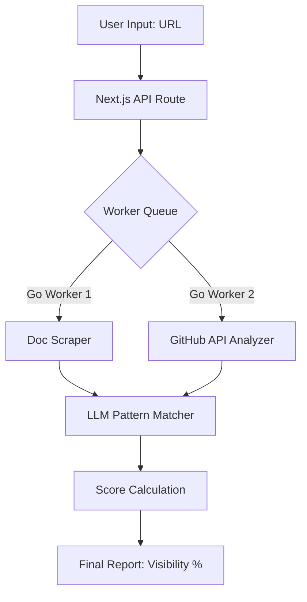

# Engineering Visibility: A Technical Guide to AEO for DevTools

### *By Antigravity | Project Case Study for Infrasity*

In the modern developer ecosystem, traditional SEO is no longer the primary driver of growth. We are entering the era of **AEO (AI Engine Optimization)**. As a backend-heavy developer specializing in data automation and Go-based systems, I approached the creation of **Synapse AI** not just as a design challenge, but as a technical problem: *How do we build interfaces that are equally legible to human developers and AI Agents?*

## 1. The Strategy: The Death of the Search Bar
The discovery funnel has fundamentally shifted. Developers have moved from "Googling for 10 minutes" to "Asking Claude for 10 seconds." If your DevTool isn't part of the LLM's context window, it effectively doesn't exist.

Traditional SEO focuses on keyword density and backlink profiles. **AEO** focuses on **Information Density** and **RAG-Readiness**. Our strategy with Synapse AI is to optimize documentation for LLM scrapers, ensuring that when an agent retrieves data, it finds high-fidelity, structured context that leads to a recommendation.

## 2. The Build: Engineering for Agents
For this assignment, I utilized a tech stack that prioritizes performance and semantic clarity.

### Next.js & React
Next.js was chosen for its static generation capabilities. By pre-rendering the landing page, we ensure that AI crawlers receive a fully hydrated HTML document instantly, minimizing the risk of "content-pop-in" that can break simpler scraping logic.

### Semantic HTML vs. "Div Soup"
A common mistake in modern frontend development is the overuse of generic `<div>` tags. For Synapse AI, I adhered to strict **Semantic HTML**.
- `<header>`, `<main>`, `<section>`, and `<article>` tags define the document hierarchy.
- This isn't just for accessibility; it allows LLM agents (like those powered by GPT-4o) to correctly identify the "Problem" vs. the "Solution" when parsing the page structure.

### JSON-LD & Structured Data
We implemented a JSON-LD schema to explicitly define the SaaS features for crawlers:

```json
{
  "@context": "https://schema.org",
  "@type": "SoftwareApplication",
  "name": "Synapse AI",
  "applicationCategory": "DeveloperTool",
  "offers": {
    "@type": "Offer",
    "price": "0",
    "priceCurrency": "USD"
  },
  "featureList": [
    "AI Visibility Scoring",
    "Semantic Documentation Indexing",
    "AEO Pipeline Optimization"
  ]
}
```

## 3. The AI Visibility Checker: Logic & Flow
The centerpiece of Synapse AI is the interactive **AI Visibility Checker**. While the current frontend is a high-fidelity mock, the underlying logic is designed for scale.

### Architecture Overview
The system is designed to handle high-concurrency scraping using a distributed worker architecture.



### Technical Detail
The "shading" and animations in the UI (implemented via **Framer Motion**) aren't just for aesthetics. They serve as "Interaction Signals" to the user, providing immediate feedback during the pseudo-latency of the scan. In a production environment, this would be backed by **Go-based workers** running on a **Linux/Fedora** cluster to ensure low-latency builds and high-performance data processing.

## 4. Conclusion
Building for the "AI-Agent Era" requires a shift in mindset. We are no longer just building for eyes; we are building for indices. Synapse AI is the first step in creating a web that is as easy for an AI to understand as it is for a developer to use.

---

**Technical Specifications:**
- **OS:** Linux (Fedora/Ubuntu testing environment)
- **Framework:** Next.js 15 (App Router)
- **Styling:** Tailwind CSS (8-pt grid system)
- **Motion:** Framer Motion (Scroll-triggered orchestration)
