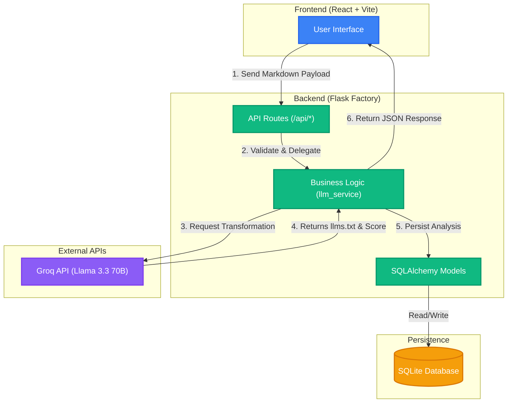

# Synapse AI: Architecture & Walkthrough

This document serves as a comprehensive 10-15 minute walkthrough of the **Synapse AI: Documentation Transformer** project. It details the architecture, codebase structure, key technical decisions, how AI is utilized, known risks, and the approach for future extensions.

---

## 1. Architecture

Synapse AI is built on a **Full-Stack Client-Server Architecture** designed to process large bodies of text, transform them using Large Language Models (LLMs), and present the results in an engaging, high-performance UI.

### The Flow

1. **Client (React/Vite)**: The user pastes markdown or plain text documentation into the web UI.
2. **API Layer (Flask)**: The frontend sends the text payload to the `/api/analyze` endpoint.
3. **Service Layer**: The Flask application validates the request and passes the text to the `llm_service`.
4. **AI Processing**: The `llm_service` communicates with the **Groq API**, utilizing the Llama 3.3 70B model to generate an optimized `llms.txt` format and an AI Search Visibility score.
5. **Persistence**: The result, along with the original input, is saved to a local **SQLite** database via **SQLAlchemy**.
6. **Response**: The transformed text and score are returned to the client and rendered with smooth `framer-motion` animations.

---

## 2. Codebase Structure

The repository is divided into two primary directories, enforcing a strict separation of concerns.

### Backend (`/backend`)
The backend uses the **Application Factory Pattern** (`app.py:create_app()`), which is crucial for scalable Flask apps and simplifies automated testing.

- **`app.py`**: The entry point. Initializes Flask, configures CORS, and registers extensions/blueprints.
- **`routes.py`**: Contains all HTTP endpoint definitions (`/api/analyze`, `/api/history`). Acts solely as a routing layer; business logic is delegated to services.
- **`services.py`**: The core business logic. Contains the `optimize_documentation` function which handles the Groq API integration and prompt engineering.
- **`models.py`**: Defines the SQLAlchemy database schemas (e.g., `ToolAnalysis`).
- **`tests/`**: Contains the `pytest` suite for automated backend validation.

### Frontend (`/frontend`)
The frontend is a modern **React 19** application bundled with **Vite**.

- **`src/App.tsx`**: The root component that manages the primary state (input text, analysis results, loading state).
- **`src/components/`**: Modular UI components.
  - `Hero.tsx`: The landing hero section.
  - `DocumentationInput.tsx`: The textarea interface for user input.
  - `ResultsView.tsx`: Displays the generated `llms.txt` and score.
  - `HistoryModal.tsx`: A dialog showing past transformations fetched from the database.
- **`src/index.css`**: Global styles and Tailwind CSS v4 configurations.

---

## 3. Key Technical Decisions

### Groq & Llama 3.3 70B
- **Why Groq?** Groq's LPU architecture provides unmatched tokens-per-second (TPS) generation speed. For a tool meant to provide immediate feedback on text transformations, low latency is critical.
- **Why Llama 3.3 70B?** This model features a massive 128k context window, allowing it to ingest entire documentation sites or large markdown files without truncating context. It also has exceptional instruction-following capabilities necessary for formatting `llms.txt`.

### Flask Application Factory & SQLite
- We chose SQLite to adhere to strict simplicity requirements. It requires zero configuration, no Docker daemon, and is instantly accessible for local development and assessment. The Application Factory pattern allows our test suite to spin up transient, in-memory SQLite instances (`sqlite:///:memory:`) so tests run isolated and fast.

### React + Tailwind CSS v4 + Framer Motion
- Tailwind v4 was selected for its zero-config, highly optimized CSS generation.
- Framer Motion is heavily utilized to mask the inherent latency of LLM network calls. By showing engaging layout animations and loading states, the perceived performance of the app remains high even when waiting 2-3 seconds for a Groq response.

---

## 4. AI Usage

AI is central to both the *product* and the *development process*.

### In the Product (Agentic Search Visibility)
The core feature uses AI to transform human-readable docs into machine-readable `llms.txt`. This is driven by strict prompt engineering in `services.py`, which instructs the LLM to output semantic markers, JSON-LD schemas, and high-density context blocks.

### In the Codebase (AI Guidance)
The project includes explicit `.cursorrules` and `claude.md` files (along with `AI_GUIDANCE.md`). These files instruct AI coding assistants (like Cline, Cursor, or Copilot) on our architectural constraints. This ensures that when AI is used to write code, it does not violate our separation of concerns or introduce unwanted dependencies.

---

## 5. Risks & Limitations

- **Rate Limiting**: The system relies heavily on the Groq API. Free tier rate limits could cause the `/api/analyze` endpoint to fail during high traffic. *Mitigation: Implement resilient error handling and visual feedback for API failures.*
- **Context Window Exhaustion**: While 128k is large, extremely massive monorepos might exceed this limit. *Mitigation: Implement a text chunking or warning mechanism on the frontend.*
- **SQLite Concurrency**: SQLite is excellent for local and single-user environments, but it struggles with high concurrent write loads. *Mitigation: The SQLAlchemy ORM makes it trivial to swap SQLite for PostgreSQL by changing the `SQLALCHEMY_DATABASE_URI` environment variable.*

---

## 6. Extension Approach

The codebase is highly modular, making it easy to extend. When adding new features, follow this flow:

1. **Database Schema**: If the feature requires data persistence, add the new model to `backend/models.py`. Run `db.create_all()` (or use Flask-Migrate in the future).
2. **Service Logic**: Add the business logic to `backend/services.py`. If integrating a new LLM provider, create a new function here.
3. **Route**: Expose the service via an endpoint in `backend/routes.py`.
4. **Testing**: Write a `pytest` case in `backend/tests/` to verify the new route and mock any external services.
5. **Frontend**: Create or update the relevant React components in `frontend/src/components/`, ensuring they use Tailwind for styling and Framer Motion for transitions.
6. **Integration**: Connect the frontend to the new backend endpoint, updating the state in `App.tsx` or a custom React hook.
